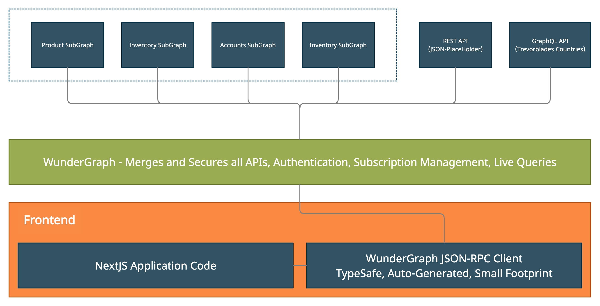

# WunderGraph Demo joining Apollo Federation (with Subscriptions), REST and GraphQL APIs and consuming it from a NextJS application

This repository demonstrates how to combine multiple APIs into one unified API
and exposing it as a secure JSON API without losing on developer experience.

We're combining the following services:
- 4 Apollo GraphQL SubGraphs (Accounts, Inventory, Products, Reviews) combined as a SuperGraph
- 1 REST API (JSON Placeholder)
- 1 standalone GraphQL API (Trevorblades Countries GraphQL API)
- 1 Mock REST API



All 7 APIs are combined into one unified GraphQL API and securely exposed using JSON RPC.

This example shows how to use Apollo Federation with Subscriptions,
a unique feature to WunderGraph.
WunderGraph is the only GraphQL Gateway that supports this feature.

Additionally, this example also shows Live Queries.
By using server-side Polling, we're able to turn any API into a realtime stream.

## Resources

Read the docs: https://wundergraph.com/docs

If you have Questions, join our Discord: https://wundergraph.com/discord

## Prerequisites

For all the demos, you need wunderctl, the cli to manage WunderGraph applications.
With wunderctl you can "init" new WunderGraph projects and start "up" a local dev environment.

Install it:

```shell
npm install -g @wundergraph/wunderctl
or
yarn global add @wundergraph/wunderctl
```

## Getting started

1. Start all four federated GraphQL services.

```shell
cd federation
docker-compose up
```

2. Run the API Server (WunderGraph)

```shell
cd api
npm install
cd .wundergraph
wunderctl up --debug
```

3. Start the frontend

```shell
cd nextjs-frontend
npm install
npm run dev
```

Open your browser and go to `http://localhost:3000`

## How does it work?

### Merging the APIs

Have a look at `./wundergraph/wundergraph.config.ts`.
The following code-snipped introspects the different APIs and merges them all together.

```typescript
const jsonPlaceholder = introspect.openApi({
    apiNamespace: "jsp",
    source: {
        kind: "file",
        filePath: "jsonplaceholder.v1.yaml",
    },
})

const weather = introspect.graphql({
    apiNamespace: "weather",
    url: "https://graphql-weather-api.herokuapp.com/",
});

const federatedApi = introspect.federation({
    apiNamespace: "federated",
    upstreams: [
        {
            url: "http://localhost:4001/graphql"
        },
        {
            url: "http://localhost:4002/graphql"
        },
        {
            url: "http://localhost:4003/graphql"
        },
        {
            url: "http://localhost:4004/graphql",
        },
    ]
});

const countries = introspect.graphql({
    apiNamespace: "countries",
    url: "https://countries.trevorblades.com/",
})

const myApplication = new Application({
    name: "api",
    apis: [
        federatedApi,
        countries,
        jsonPlaceholder,
        weather,
    ],
});
```

Once everything is merged, and the configuration is built,
the WunderGraph engine is able to delegate all Requests tox the correct upstream(s).

By applying namespaces to each individual API,
we're able to avoid naming conflicts when merging multiple APIs.

### Request Flow

All Operations from the `.wundergraph/operations` folder will be automatically turned into Persisted Operations.
That is, each Operation will be pre-compiled and mounted on a unique URL Path.
E.g. the Operation `Countries.graphql` will turn into the Endpoint `/api/main/operations/Contries`.

In addition to this Endpoint, `wunderctl up` will also start a code-generator that generates a TypeScript API Client, React Hooks, etc...
Have a look at the folder `nextjs-frontend/generated` to see all the generated code.

Once a JSON-RPC Request hits the WunderNode (WunderGraph Server),
it will call into various middlewares for authentication, caching, etc.
and then execute the pre-compiled Operation.

This makes the API very secure and performant.
Additionally, our GraphQL Gateway Engine is capable of doing Subscriptions for Apollo Federation as well as Live-Queries to keep the UI automatically updated.

## Hacking

### Modifying Operations

Go to `api/.wundergraph/operations`, add, remove or modify the operations.

### Updating the Frontend

Go to `nextjs-frontend/pages/index.tsx` and modify the UI, it definitely needs some love for the CSS!

### Adding or Removing DataSources

Go to `api/.wundergraph/wundergraph.config.ts` and modify the introspected DataSources. 